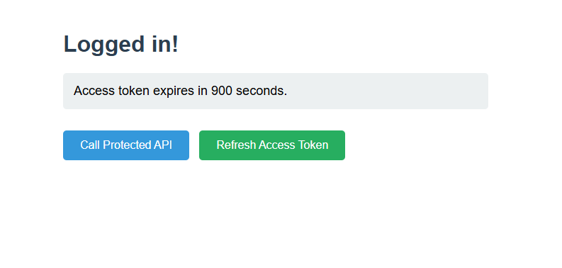
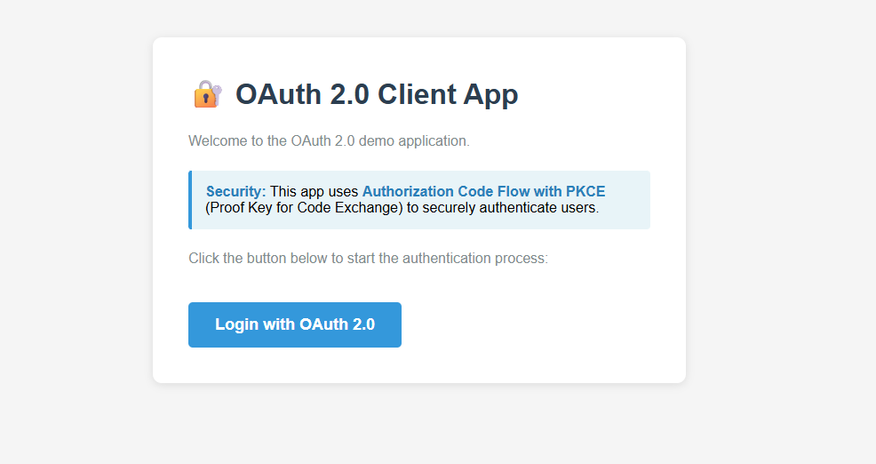
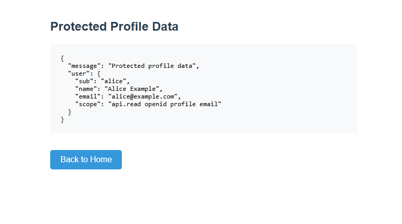

# OAuth 2.0 Implementation with PKCE

A complete implementation of the OAuth 2.0 Authorization Code Flow with PKCE (Proof Key for Code Exchange) using Node.js and Express. This project demonstrates secure authentication and authorization patterns with three separate servers working together.



## 📋 Table of Contents

- [Overview](#overview)
- [Architecture](#architecture)
- [Features](#features)
- [Prerequisites](#prerequisites)
- [Installation](#installation)
- [Running the Application](#running-the-application)
- [Testing](#testing)
- [Project Structure](#project-structure)
- [API Documentation](#api-documentation)
- [Security Features](#security-features)
- [License](#license)

## 🎯 Overview

This project implements a production-ready OAuth 2.0 system consisting of three components:

1. **Authorization Server** - Issues authorization codes and JWT access tokens
2. **Client Application** - Initiates OAuth flow and manages user sessions
3. **Resource Server** - Protects API endpoints and validates JWT tokens

The implementation follows OAuth 2.0 best practices including:
- PKCE (RFC 7636) for enhanced security
- JWT tokens signed with RS256
- JWKS endpoint for public key distribution
- Scope-based authorization
- Refresh token support

## 🏗️ Architecture

```
┌─────────────┐         ┌──────────────────┐         ┌─────────────────┐
│   Client    │────────▶│  Authorization   │◀────────│    Resource     │
│ Application │         │     Server       │         │     Server      │
│ :4000       │         │     :3000        │         │     :5000       │
└─────────────┘         └──────────────────┘         └─────────────────┘
       │                         │                            │
       │  1. /authorize          │                            │
       │  + PKCE challenge       │                            │
       │────────────────────────▶│                            │
       │                         │                            │
       │  2. Authorization Code  │                            │
       │◀────────────────────────│                            │
       │                         │                            │
       │  3. /token              │                            │
       │  + PKCE verifier        │                            │
       │────────────────────────▶│                            │
       │                         │                            │
       │  4. Access Token (JWT)  │                            │
       │◀────────────────────────│                            │
       │                         │                            │
       │  5. API Call + Bearer Token                          │
       │─────────────────────────────────────────────────────▶│
       │                         │                            │
       │                         │  6. Verify JWT via JWKS    │
       │                         │◀───────────────────────────│
       │                         │                            │
       │  7. Protected Resource  │                            │
       │◀─────────────────────────────────────────────────────│
```

## ✨ Features

### Authorization Server
- ✅ OAuth 2.0 Authorization Code Flow
- ✅ PKCE (S256 method) support
- ✅ JWT token generation with RS256 signing
- ✅ Refresh token support
- ✅ JWKS endpoint for public key distribution
- ✅ Authorization code expiration (5 minutes)
- ✅ Access token expiration (15 minutes)

### Client Application
- ✅ PKCE code verifier and challenge generation
- ✅ State parameter for CSRF protection
- ✅ Secure cookie-based session management
- ✅ Token refresh functionality
- ✅ Clean, user-friendly UI



### Resource Server
- ✅ JWT token validation using JWKS
- ✅ Scope-based authorization
- ✅ Issuer and audience claim verification
- ✅ Token expiration validation
- ✅ Protected API endpoints



## 📦 Prerequisites

- **Node.js** >= 20.0.0 (for native test runner and mocking)
- **npm** >= 9.0.0

## 🚀 Installation

### 1. Clone the repository

```bash
git clone https://github.com/rvega1204/OAuth2-Nodejs.git
```

### 2. Install dependencies for each server

```bash
# Authorization Server
cd auth-server
npm install

# Client Application
cd ../client-app
npm install

# Resource Server
cd ../resource-server
npm install
```

### 3. Verify installation

```bash
# Check Node.js version
node --version  # Should be >= 20.0.0
```

## 🏃 Running the Application

You need to start all three servers in separate terminal windows.

### Terminal 1: Authorization Server

```bash
cd auth-server
npm start
```

**Expected output:**
```
Auth Server running on http://localhost:3000
```

### Terminal 2: Resource Server

```bash
cd resource-server
npm start
```

**Expected output:**
```
Resource Server running on http://localhost:5000
```

### Terminal 3: Client Application

```bash
cd client-app
npm start
```

**Expected output:**
```
Client App running on http://localhost:4000
```

### 4. Test the application

1. Open your browser and navigate to `http://localhost:4000`
2. Click **"Login with OAuth 2.0"**
3. You'll be redirected through the OAuth flow (auto-login for demo)
4. See the success page with token expiration information
5. Click **"Call Protected API"** to access protected resources

## 🧪 Testing

All three servers include comprehensive test suites using Node.js native test runner.

### Run all tests

```bash
# Authorization Server tests
cd auth-server
npm test

# Client Application tests
cd client-app
npm test

# Resource Server tests
cd resource-server
npm test
```

### Run tests in watch mode

```bash
npm run test:watch
```

### Test Coverage

Each test suite includes:

**Authorization Server (auth-server/index.test.js)**
- ✅ Helper function tests (base64url, PKCE, key generation)
- ✅ Authorization endpoint validation
- ✅ Token exchange with PKCE verification
- ✅ Refresh token flow
- ✅ JWKS endpoint validation
- ✅ Full integration tests

**Client Application (client-app/index.test.js)**
- ✅ PKCE parameter generation
- ✅ Authorization request flow
- ✅ Callback handling with state validation
- ✅ Token storage and management
- ✅ Protected API calls with mocked responses
- ✅ Token refresh flow

**Resource Server (resource-server/index.test.js)**
- ✅ JWT authentication middleware
- ✅ Scope-based authorization
- ✅ Token validation (expiration, issuer, audience)
- ✅ Protected endpoint access control
- ✅ Error handling and security

## 📁 Project Structure

```
oauth2-node/
├── auth-server/
│   ├── app.js              # Core authorization server logic
│   ├── index.js            # Server entry point
│   ├── index.test.js       # Test suite
│   ├── package.json        # Dependencies
│   └── node_modules/
│
├── client-app/
│   ├── app.js              # Core client application logic
│   ├── index.js            # Server entry point
│   ├── index.test.js       # Test suite
│   ├── package.json        # Dependencies
│   └── node_modules/
│
├── resource-server/
│   ├── app.js              # Core resource server logic
│   ├── index.js            # Server entry point
│   ├── index.test.js       # Test suite
│   ├── package.json        # Dependencies
│   └── node_modules/
│
├── imgs/
│   ├── logged.png          # Logged in state screenshot
│   ├── loginup.png         # Login page screenshot
│   └── protected.png       # Protected resource screenshot
│
└── README.md               # This file
```

## 📖 API Documentation

### Authorization Server (Port 3000)

#### `GET /authorize`

Initiates the authorization flow. Issues an authorization code bound to PKCE challenge.

**Query Parameters:**
- `response_type` (required): Must be `"code"`
- `client_id` (required): Client identifier
- `redirect_uri` (required): Callback URL
- `scope` (optional): Space-separated scopes
- `state` (optional): CSRF protection token
- `code_challenge` (required): PKCE challenge (base64url)
- `code_challenge_method` (required): Must be `"S256"`

**Response:**
- `302 Redirect` to `redirect_uri` with `code` and `state` parameters

---

#### `POST /token`

Exchanges authorization code for access token or refreshes access token.

**Content-Type:** `application/x-www-form-urlencoded`

**Authorization Code Grant:**
```
grant_type=authorization_code
code=<authorization_code>
redirect_uri=<callback_url>
client_id=<client_id>
code_verifier=<pkce_verifier>
```

**Refresh Token Grant:**
```
grant_type=refresh_token
refresh_token=<refresh_token>
client_id=<client_id>
```

**Response:**
```json
{
  "access_token": "eyJhbGciOiJSUzI1NiIs...",
  "token_type": "Bearer",
  "expires_in": 900,
  "refresh_token": "random_token_value",
  "scope": "api.read openid profile email"
}
```

---

#### `GET /.well-known/jwks.json`

Returns the JSON Web Key Set for JWT verification.

**Response:**
```json
{
  "keys": [
    {
      "kty": "RSA",
      "use": "sig",
      "alg": "RS256",
      "kid": "demo-key-1",
      "n": "...",
      "e": "AQAB"
    }
  ]
}
```

---

### Client Application (Port 4000)

#### `GET /`

Landing page with login button.

---

#### `GET /login`

Initiates OAuth flow by redirecting to authorization server with PKCE parameters.

---

#### `GET /callback`

OAuth callback endpoint. Exchanges authorization code for tokens.

**Query Parameters:**
- `code`: Authorization code from auth server
- `state`: State parameter for validation

---

#### `GET /profile`

Displays user profile by calling the protected API.

**Requires:** Valid access token in cookies

---

#### `GET /refresh`

Refreshes the access token using the refresh token.

**Requires:** Valid refresh token in cookies

---

### Resource Server (Port 5000)

#### `GET /health`

Health check endpoint (unprotected).

**Response:**
```json
{
  "status": "ok",
  "service": "resource-server"
}
```

---

#### `GET /api/profile`

Protected endpoint returning user profile data.

**Authentication:** Bearer token required  
**Authorization:** Scope `api.read` required

**Headers:**
```
Authorization: Bearer <jwt_access_token>
```

**Response:**
```json
{
  "message": "Protected profile data",
  "user": {
    "sub": "alice",
    "name": "Alice Example",
    "email": "alice@example.com",
    "scope": "api.read openid profile email"
  }
}
```

**Error Responses:**
- `401 Unauthorized`: Missing or invalid token
- `403 Forbidden`: Insufficient scope

## 🔒 Security Features

### PKCE (Proof Key for Code Exchange)

PKCE prevents authorization code interception attacks by:
1. Client generates random `code_verifier`
2. Client derives `code_challenge` = SHA256(code_verifier)
3. Authorization server stores the challenge
4. Client proves possession by sending the verifier
5. Server validates: SHA256(verifier) === stored_challenge

**Implementation:**
```javascript
// Generate verifier (client)
const code_verifier = base64url(randomBytes(32));

// Generate challenge (client)
const code_challenge = base64url(sha256(code_verifier));

// Validate (server)
const computed = sha256Base64Url(code_verifier);
if (computed !== stored_challenge) {
  throw new Error("PKCE validation failed");
}
```

### State Parameter

Protects against CSRF attacks:
- Client generates random state
- Stored in httpOnly cookie
- Validated on callback
- Prevents malicious authorization responses

### JWT Security

**Signing:**
- Algorithm: RS256 (RSA with SHA-256)
- Key size: 2048 bits
- Private key never leaves authorization server

**Validation:**
- Signature verification using JWKS
- Issuer claim (`iss`) validation
- Audience claim (`aud`) validation
- Expiration time (`exp`) validation
- Not before time (`nbf`) validation

**Claims:**
```json
{
  "sub": "alice",
  "iss": "http://localhost:3000",
  "aud": "demo-client",
  "exp": 1234567890,
  "iat": 1234567000,
  "scope": "api.read openid",
  "name": "Alice Example",
  "email": "alice@example.com"
}
```

### Token Expiration

- **Authorization Code**: 5 minutes
- **Access Token**: 15 minutes
- **Refresh Token**: No expiration (revocable)

### Secure Cookie Management

```javascript
res.cookie('access_token', token, {
  httpOnly: true,    // Prevents XSS
  secure: true,      // HTTPS only (production)
  sameSite: 'strict' // CSRF protection
});
```

## 🔧 Configuration

### Environment Variables

You can configure servers using environment variables:

**Authorization Server:**
```bash
PORT=3000
ISSUER=http://localhost:3000
```

**Client Application:**
```bash
PORT=4000
AUTH_SERVER=http://localhost:3000
RESOURCE_SERVER=http://localhost:5000
CLIENT_ID=demo-client
REDIRECT_URI=http://localhost:4000/callback
```

**Resource Server:**
```bash
PORT=5000
ISSUER=http://localhost:3000
AUDIENCE=demo-client
JWKS_URL=http://localhost:3000/.well-known/jwks.json
```

## 🛠️ Development

### Code Style

The project follows these conventions:
- ES Modules (import/export)
- Async/await for asynchronous operations
- JSDoc comments for documentation
- Descriptive function and variable names

### Adding New Scopes

**1. Authorization Server** - Add scope to token:
```javascript
const accessToken = await new SignJWT({
  scope: "api.read api.write openid", // Add new scope
  // ...
})
```

**2. Resource Server** - Protect endpoint:
```javascript
app.get("/api/write", 
  requireAuth, 
  requireScope("api.write"), // New scope
  (req, res) => {
    // Handler
  }
);
```

### Adding New Clients

```javascript
// In auth-server/app.js
clients.set("new-client-id", {
  client_id: "new-client-id",
  redirectUris: [
    "http://localhost:8080/callback",
    "http://localhost:8080/oauth/callback"
  ]
});
```

## 📚 Resources

- [OAuth 2.0 RFC 6749](https://datatracker.ietf.org/doc/html/rfc6749)
- [PKCE RFC 7636](https://datatracker.ietf.org/doc/html/rfc7636)
- [JWT RFC 7519](https://datatracker.ietf.org/doc/html/rfc7519)
- [JWKS RFC 7517](https://datatracker.ietf.org/doc/html/rfc7517)
- [OAuth 2.0 Security Best Practices](https://datatracker.ietf.org/doc/html/draft-ietf-oauth-security-topics)

## 🐛 Troubleshooting

### Common Issues

**1. Tests failing with "Cannot find package 'axios'"**
```bash
cd client-app
npm install axios
```

**2. Port already in use**
```bash
# Find and kill process
lsof -ti:3000 | xargs kill -9  # macOS/Linux
netstat -ano | findstr :3000   # Windows
```

**3. JWKS verification fails**
- Ensure authorization server is running
- Check JWKS_URL is correct
- Verify network connectivity between servers

**4. PKCE validation fails**
- Verify code_verifier matches the original
- Check code_challenge was generated with S256
- Ensure authorization code hasn't expired

## 📄 License

This project is licensed under the **MIT License** and is free for educational use.

## 🤝 Contributing

Contributions are welcome! This is an educational project designed to demonstrate OAuth 2.0 concepts.

### Guidelines:
1. Fork the repository
2. Create a feature branch
3. Write tests for new functionality
4. Ensure all tests pass
5. Submit a pull request

## Author

Ricardo Vega 2026

---

Happy learning! 🚀